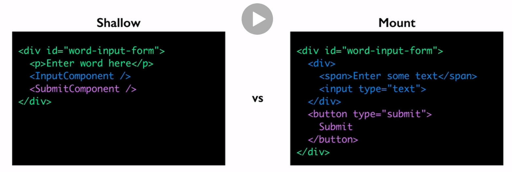

# Fundamentals of Testing React Apps

At the time of doing this react-18 is out but create-react-app sets up suing React-17. Also do not want to update due to the reasons below.

## Jest vs Enzyme

1. Jest is a fully-featured testing framework. That means that it doesn’t just help you test React components. Jest provides a test-running script that will run all your tests, as well as an entire assertion library. Jest works great with React, but it’s not limited just to React. If you’re building your web application entirely in JavaScript, for instance using NodeJS to build your server, Jest allows you test your whole application with one test library

2. Enzyme serves a different purpose. Instead of serving as a full testing library, Enzyme is a library that makes testing React components specifically easier. It integrates with many full testing libraries, including Jest. If you’re using React in your application, it might make sense to use Enzyme and Jest together to automatically test your UI.

3. Jest is frmaework, so it's also a test runner. That's why we need with alongside enzyme or testing-libray

## Basics

1. jest watch mode runs when i run `yarn test`

2. jest watch mode only runs files that have updated since last commit

3. to run tests jest looks for files that ends with `.test.js`

4. by default (if you look at the initial `App.test.js file`), you see `@testing-library/react` is used but I will use enzyme instead

   ```js
   import { render, screen } from "@testing-library/react";
   import App from "./App";

   // test takes 2 arguments
   // 1. Name of test
   // 2. A function which is the test
   test("renders learn react link", () => {
     render(<App />);
     const linkElement = screen.getByText(/jest/i);
     expect(linkElement).toBeInTheDocument();
   });
   ```

5. We have a global `test()` function. The function is provide by `Jest`

6. Which has 2 params. Test `name` and the testing `function` which will be run

7. Finally we make assertions using the `expect()` method, a test passes if the assertions is true

## Enzyme vs Testing-Library

1. Creates a `virtual DOM` for testing

2. Can interact with this DOM by sending it (element) events and asserting against this DOM by seeing what it looks like upon rendering, or after we have interacted with the elements

3. The virtual DOM allows us to test without a browser

4. Both `enzyme` and `testing-library` do this

5. Mostly the differences are philosophical, ie how you should test

6. Enzyme supports isolated testing/testing elements in isolation by shallow rendering (discussed in detail later)

7. But the idea is it only renders the component and not its children

8. In contrast React Testing Library strongly prefers `functional testing` (see below)

9. Meaning reacting with the components way the user would. This makes the tests less isolated. For example a user will never interact with and element without also seeing the child elements

## Why choose Enzyme and Testing philopshies

1. More traditional testing style

2. Tests are focused on an area of your code as opposed to specific user flow

3. Can write tests that are isolated to specific areas of your code using Mocks and shallow rendering

4. This way tests are less polluted by other code that might be running

5. Tests are easy to diagnose due to this isolation

6. On the other hand Functional tests are more resilient to changes. For example if the code changes but the behaviour does not, we do not need to change the test

7. This also makes functional tests difficult to diagnose

8. Fianlly lot of legacy code uses enzyme for testing, because it was made before testing-library

9. The author has actually switched over to testing-library (see the other course)

10. [Why she converted](https://bonniedotdev.medium.com/testing-react-a-converts-journey-from-enzyme-to-testing-library-70f85eebb674)

## Shallow Rendering

1. Renders components only one lvl deep

2. Renders Parent, but uses placeholders for children


