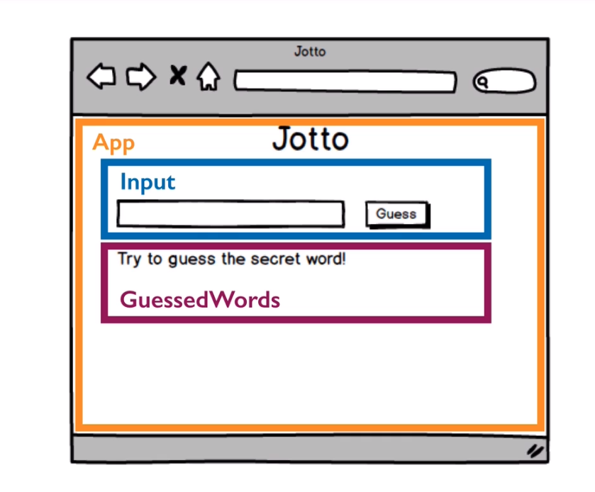
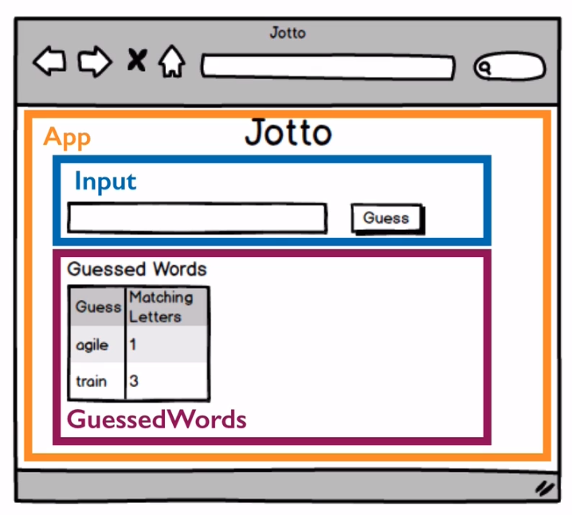
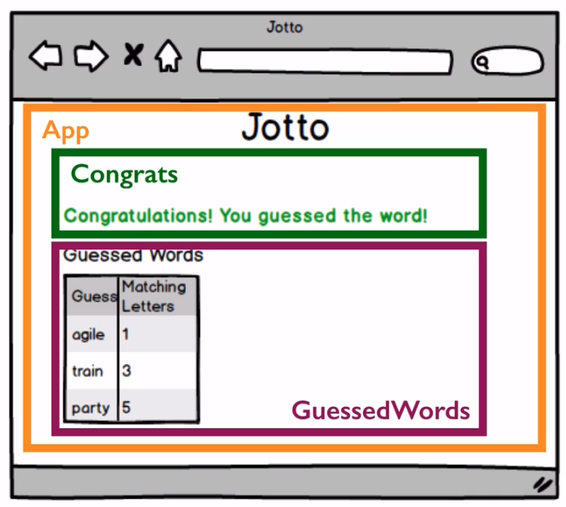

# Jotto App Testing Part 1: Setup & Testing Props

1. In this section we will set up everything

2. We will also learn to test props

3. [Code Repo](https://github.com/SSaquif/jotto/tree/master/src)

## Resources

1. [prop-types](https://www.npmjs.com/package/prop-types)

2. [check-prop-types](https://www.npmjs.com/package/check-prop-types)

## Wireframes

I think this is a good app to do some wirefrmaing with figma

<p align='center'>
    
</p>

<p align='center'>
    
</p>

<p align='center'>
    
</p>

## setupTests.js

1. This file is created by default by create-react-app

2. We will add our enzyme setup our here

3. So it will run before every test

4. We move the following imports and function call in the setupTest.js file and can remove them from other test files. It's global now.

```js
import Enzyme from "enzyme";
import EnzymeAdapter from "@wojtekmaj/enzyme-adapter-react-17";

Enzyme.configure({ adapter: new EnzymeAdapter() });
```

## Plan

Order of testing

1. `Congrats` and `GuessedWords` components
2. `Input` and `App` components
3. After finishing the above 4 components
4. We can either use Context or Redux for global state
5. I will do both

## `Congrats` and `GuessedWords`

We will test these 2 components first

1. Will be testing props for this components

   1. Make sure props have right type
   2. And when they are not missing when required
   3. This components will be receiving state from the parents as props
   4. D'ont need Redux or Context for this section
   5. Can skip props testing if you use TypeScript
   6. Prop testing we are doing will be using proptypes
   7. With TS proptypes are obsolete

2. We will also setup common tools in this section
   1. Define functions in helper file
   2. Setup Enzyme for every file via jest config

### `Input` and `App` components

In these components we will start testing hooks

1. Input component: Has a state controlled field

   1. UseState hook
   2. We will see how to mock the useState hook in order to set initial conditions for what the state is for our test

2. App component: will get a secret word whenever the component mounts
   1. useEffect hook

## Testing : Congrats Component

1. See the component and test file

2. They also have JSDoc in them

3. Child of App

4. Has access to `success`, a piece of state, passed down from App

### Plan

1. Will receive success state as prop

2. If succes state is true, then will render a congratulatory msg

3. If false we will simpl return null

### Test Setup

```js
// This function is how we set up our initial prop testing
const setup = (props = {}) => {
  // We pass the shallow component our props object
  return shallow(<Congrats {...props} />);
};

test("renders without error", () => {});

test("renders no text when `success` prop is false", () => {});

test("renders non-empty congrats msg when `success` prop is true", () => {});

test("", () => {});
```

### Final Tests

1. Component

   ```js
   function Congrats({ success }) {
     return (
       <div data-test="congrats-component">
         {success ? (
           <span data-test="congrats-msg">You Guessed It!!</span>
         ) : (
           <></>
         )}
       </div>
     );
   }
   ```

2. Tests

   ```js
   const setup = (props = {}) => {
     return shallow(<Congrats {...props} />);
   };

   test("renders without error", () => {
     const wrapper = setup();
     const component = findByTestAttr(wrapper, "congrats-component");
     expect(component.length).toBe(1);
   });

   test("renders no text when `success` prop is false", () => {
     const wrapper = setup({ success: false });
     const component = findByTestAttr(wrapper, "congrats-component");
     expect(component.text()).toBe(""); // React Fragment returned == Empty string
   });

   test("renders non-empty congrats msg when `success` prop is true", () => {
     const wrapper = setup({ success: true });
     const component = findByTestAttr(wrapper, "congrats-message");
     expect(component.text().length).not.toBe(0);
   });
   ```

## PropTypes Testing

1. Not required if we are using TS

2. If there are no proptypes, the proptypes test always passes

3. So always check with some bad props, to make sure it does fail

### Test

1. Test, before putting it in the `testUtils`

   ```js
   test("does not throw warning with expected props", () => {
     // No need to call setup() and create a shallowWrapper

     const expectedProps = { success: false };

     const propError = checkPropTypes(
       Congrats.PropTypes, // Actual Props
       expectedProps, // Expected Props (i.e some valid props)
       "prop", // we are testing props
       Congrats.name // Name of the component
     );
     // If Test Passes, no error msg so its undefined
     expect(propError).toBeUndefined();
   });
   ```

### Updated Congrats Component and Tests

1. Need to import and create proptypes for the component

2. The first test will also need to be updated by passing success prop now. Since it's required. Otherwise will get warning. But I setup default props to avoid it. See below for details

   ```js
   import PropTypes from "prop-types";

   // ... Component Code

   Congrats.propTypes = {
     success: PropTypes.bool.isRequired,
   };
   ```

3. Finally added a defaultProps object in the Test file. Can help with DRY. But also need to be careful and make sure I am not passing incorrect props by doing this.

## Testing : GuessWords Component

### Props

| Props        | Data Type        | Description                                       | Initial Value |
| ------------ | ---------------- | ------------------------------------------------- | ------------- |
| guessedWords | Array of Objects | [{word: string, <br/>matchedLetterCount: number}] | []            |

Guessed Words

### PropType

```js
GuessedWords.propTypes = {
  guessedWords: PropTypes.arrayOf(
    PropTypes.shape({
      GuessedWord: PropTypes.string.isRequired,
      matchedLetterCount: PropTypes.number.isRequired,
    })
  ).isRequired,
};
```

### Plan

1. Check the wireframe to see what tests we need

2. Initially has some text, and than changes to show past guesses

3. This are sufficiently different contexts.

4. And we will be doing enough test within each context, that its good idea to separate the test context using `describe`

   ```js
   describe("if no words guessed", () => {});

   describe("if there are words guessed", () => {});
   ```

### Test Setup with describe and beforeEach

1. We will be using the same shallow wrapper in both tests for the first tesing context so, its good idea to `set it up from scratch` before each test

2. We want `wrapper` to be available in the entire scope

```js
describe("if no words guessed", () => {
  let wrapper;
  beforeEach(() => {
    // Overwriting Default Props as we need empty array
    wrapper = setup({ guessedWords: [] });
  });
  test("renders without error", () => {});
  test("renders instruction to guess a word error", () => {});
});

describe("if there are words guessed", () => {
  test("renders without error", () => {});
  test('renders "guessed words" section', () => {});
  test("displays correct number of guessed words");
});
```

### Final Tests

1. [Component](https://github.com/SSaquif/jotto/blob/master/src/GuessedWords.js)
1. [Component Tests](https://github.com/SSaquif/jotto/blob/master/src/GuessedWords.test.js)
